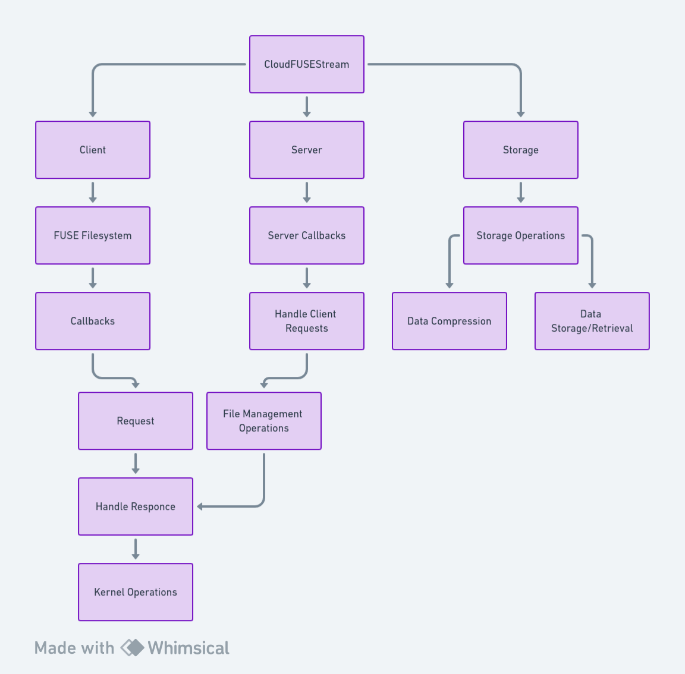

# CloudFUSEStream

## Description

CloudFUSEStream (CFStream): An innovative network filesystem, enabling smooth and secure access to cloud files via FUSE. It allows users to mount, manage, and sync files across devices, ideal for remote data access and management.

> **Note:** This project is developed and tested on Ubuntu 22.04 LTS. It may not work on other platforms.

## Features

## Dependencies

You can install the dependencies using the following command:
```bash
chmod +x install_dependencies.sh && ./install_dependencies.sh
```

## Installation
```bash
git clone https://github.com/AurelienBaraquin/CloudFUSEStream
cd CloudFUSEStream
chmod +x install.sh && ./install.sh
mkdir store
make
```

## Usage

### Mounting the filesystem

***First of all you need to start the server :***

> **Note:**
> Make sure a "store" folder exists in the current directory

```bash
./CFStream host [port]
```

***Then anybody can connect to your server and mount there own filesystem :***

```bash
./CFStream connect [ip] [port] <fuse options> [mountpoint]
```

*Useful options (see [FUSE documentation](https://libfuse.github.io/doxygen/structfuse__args.html) for more details) :*
| Option | Description |
| ------ | ----------- |
| -d     | Enable debug mode |
| -f     | Run in foreground |
| -s     | Single-threaded |
| -h     | Print help |

> **Note:**
> If you want to mount the server and the client on the same machine, you can use a local ip address like 127.0.0.1

### Unmounting a cloud storage

```bash
umount [mountpoint]
```

To stop the server, just press Ctrl+C

> **Note:**
> All clients will be forced disconnected, and there filesystem can crash, so be careful it's better to stop the filesystem before stopping the server

## A little diagram to understand how it works

